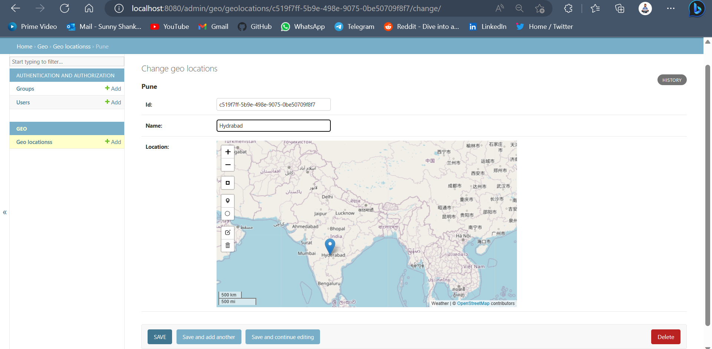

## Geodjango-Development
This is a Geodjango project that utilizes PostGIS, Leaflet, geopy for retrieving location coordinates, and api.weather.gov for fetching forecast data and displaying it.

### How to 
* create a .env Enviroment file using .env.example schema.
```
pip install -r requirement.txt
python manage.py makemigrations
python manage.py migrate
python manage.py runserver
```

* Using Docker
    ```
    docker-compose up
    ```


### Screenshot

1. Admin Page
    
2. Main 
    
3. Add Location
    